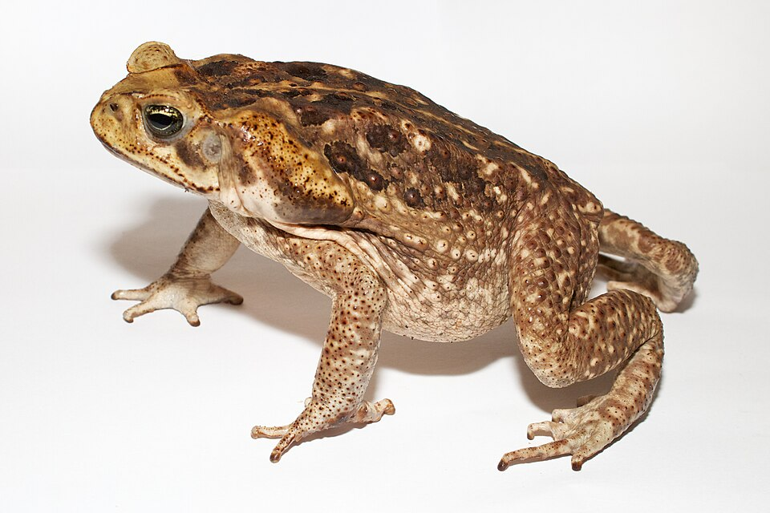

# Why pipelines? {#sec-why-pipelines}

In this section we will discuss why pipelines are a useful idea. We will use an example analysis of [cane toad](https://en.wikipedia.org/wiki/Cane_toad) data to help motivate this. 

Many Australians, particularly those in Queensland, are familiar with the almost-folklore tale of the cane toad. For the unfamiliar, cane toads were introduced to Australia in 1935 as a form of pest control, to eat the cane beetle, who were eating sugar cane. The cane toad was not very good at eating the cane beetle, who lived near the top of the sugar cane, and the cane toads were poor climbers. The cane toad was a prolific breeder, and quickly spread across wider Queensland. It has severely impacted local fauna, as it has poison glands that will kill most animals. Even it's tadpoles are highly toxic.

So, this analysis follows a story of using various releases of existing cane toad data. Our aim of the analysis is to plot where they are, and work out how fast they are moving.

::: {.overview}

## Overview {.unnumbered}

**Duration** 90 minutes

**Questions**

<!-- These map onto the sections below, in order. If you move a section, move its question. -->

- Why would I want a pipeline at all?
- Where were the cane toads, and how far did they move?
- What changes when my script becomes a document?
- What happens when more data arrives?
- How do I know if my outputs are current?

**What you need this session**

- A session of RStudio open
- The packages from [Setup](setup.qmd)
- The script and data I send you at the start of the session

:::

```{r}
#| label: setup
#| include: false
knitr::opts_chunk$set(collapse = TRUE, comment = "#>", message = FALSE)

# The code in "Replicate it" comes from the script's `# ---- label ----`
# sections, so the book always shows what the script says.
knitr::read_chunk("ch1/01-flat-script.R")
```



_Photo by [Brian Gratwicke](https://www.flickr.com/photos/briangratwicke/) Found on [wikimedia](https://commons.wikimedia.org/wiki/File:Adult_Cane_toad.jpg), licensed under [CC BY 2.0](https://creativecommons.org/licenses/by/2.0/deed.en)_

:::{.callout-note title="Your Turn: Discussion on pipelines and reproducibility"}

Let's discuss:

- What do you know about reproducibility? What do you think of when you hear "reproducibility"?
- Have you heard of pipelines before?
- What sort of issues have you encountered with reproducibility?
- What are you hoping to get out of this course?
- What are your concerns with applying this material?

:::

## Why pipelines?

Data analysis is iterative. Cleaning, exploring and modelling rarely run start to finish without problems. Every step forward you take, sometimes takes you a couple back. E.g., finding a problem in a plot takes you to a problem with data cleaning.

I find a common pattern then is to re-run the code - from the top. It's easier to just start "carte blanche" each time, because it's too hard to work out hiwch parts of the analysis need re-running.

This can be fine. If you're lucky! Often times your analysis can be so big - in terms of taking time, or managing complexity, that re-running it costs real time.

So then you start saving the intermediate steps. Now you have another problem...how do you know when to re-run one part of the analysis, which other parts depend upon changes to another?

This class of problems is what pipeline tools are designed to solve. They watch which files change, and which part of the code depends on those files. Then, they can run only the parts that depend upon them.

In R, [targets](https://books.ropensci.org/targets/) is one of these pipeline toolkits, and it's what we will be learning how to use.

The rest of this chapter is mostly hands-on programming. We will start with some toad data.

## Live coding

- Reading in cane toad data
- Exploring it
- Save the script

## The question

Toads were released at one place, on one date, and they spread west. So how far west did the edge get, decade by decade, and how far did it move each time?

Somebody has emailed you some files: A script, and some data. 

## Replicate it

Below you can view the entire analysis that I will live code:

::: {.callout-note title="The live code" collapse="true"}

Here's the script, a piece at a time. The code below is read straight out of `ch1/01-flat-script.R`, so what you see here is what's in the file.

```{r}
#| label: read
```

One row is one report of one species, at one place, on one date. It isn't a survey, and it isn't a count. Somebody saw a toad and wrote it down.

The column names are long, and they are in camel case. `{janitor}` tidies them up.

```{r}
#| label: names
```

Then shorter names for the columns we use most, and a year and a decade to group by.

```{r}
#| label: tidy
```

### What have we got?

Before trusting anything that comes out of this, look at it.

```{r}
#| label: look
```

```{r}
#| label: over-time
```

That's how often somebody wrote a toad down, not how many toads there were. More records in the 1990s mostly means more people looking.

### Where are they?

First, just the points. Then the points on a map of Australia.

```{r}
#| label: map-first-look
```

They're all in one state, so zoom in on Queensland.

```{r}
#| label: map-qld
```

You can watch them come down the coast and head inland.

### Find the front

The front is the westernmost record in each decade. Longitude gets smaller as you go west, so that's the smallest `lon`.

```{r}
#| label: front
```

```{r}
#| label: front-map
```

### How far did it move?

`{geodist}` measures distances across the surface of the earth, in metres. It takes a matrix of coordinates.

`sequential = TRUE` measures from each row to the next, rather than every row to every other row. There's no step into the first decade, so `pad = TRUE` puts an `NA` there.

```{r}
#| label: distance
```

The 1960s are the big one, at about `r round(toad_speed$distance_km[toad_speed$decade == 1960])` km.

Look closely at the 1990s, though. The westernmost record is further *east* than it was in the 1980s, and the distance is still positive. A distance doesn't know which way it went.

:::

::: {.callout-note title="Your Turn"}

1. Run the script top to bottom. Do you get the same distances?
2. Which decade moved furthest? Find it on the map.
3. The front is a single record each decade. What could go wrong with that?

:::

## From a script to a document

Someone wants to read this! Can you convert this into a quarto document?

So put it in a Quarto document. Each part of the script goes in a chunk, with a sentence or two around it saying what it does.

::: {.callout-note title="Your Turn"}

Turn `01-flat-script.R` into a Quarto document, and render it.

:::

## Tidy it up

Now make it read like a document.

- **Libraries at the top.** Put all `library()` calls at the top.
- **Tidy up the iterations.** The `View()`, the `names()` before `clean_names()`, the plot without a map, the plot with the whole of Australia. Those were you working it out. They were useful at the time.

Let's make this a shorter, tidy document.

::: {.callout-note title="Your Turn"}

1. Move every `library()` call into one chunk at the top.
2. Remove the steps that were you exploring.
3. Render it again. Does it still give the same distances?

:::

## Someone wants the data

Your work is getting noticed!

A colleague asks you for the data with the distances added.

Sure, you say, you can add this to the quarto file?

```{r}
#| label: write-csv
#| eval: false
write_csv(toad_speed, here("output/toad-speed.csv"))
```

Render, and the CSV is there.

::: {.callout-note title="Your Turn"}

Add the `write_csv()` chunk and render.

1. Change a single word in the text and render again. Did the CSV change?
2. If your colleague opened the CSV tomorrow, how would they know which render wrote it?

:::

## Rendering a document to write a dataset?

It's a lot!


But something about this feels a bit strange? You are rendering a document, and you get:

- plots, HTML file
- a written CSV file

Creating the CSV is a side effect of rendering.

It's only as current as your last render, and renders happen for reasons that have nothing to do with the data:

> Fix a typo in a sentence? CSV gets rewritten.
> If the render fails halfway, the file might get re-written? Depending on where it is?

And like, how do you know which version of the code produced it? How do you know it is up to date? Can we trust that this data came from the new data? Or is it the old one? Should we just run it again to be sure?

I don't think that rendering a document to save data a good idea.

I'm not saying don't save data! That's a good thing.

But I am saying that writing a file should be a step that something keeps track of, rather than something that happens on the way past.

## How else could you lay this project out?

Is there another way you could lay the project out?

**One long script.** That's what you were sent. It works, and it's where everybody starts.

**Numbered scripts.** Split it into `01-read.R`, `02-clean.R`, `03-front.R` and `04-distance.R`.

- Better! The numbers give the project an entry point. Someone new knows where to start.
- But they don't tell you what needs running again. Change `02-clean.R`, and you have to remember that 03 and 04 depend on it.

**One Quarto document.** 

- Everything in one place, the report comes for free. 

**Functions, with a driver script.** 

- R functions go in `R/`
- A short `analysis.R` calls them in order

```
toad-analysis/
├── data/          what arrived, never edited by hand
├── R/             functions: code that gets used
├── analysis.R     code that gets run, in order
└── output/        anything you could delete and make again
```

This is my favourite. We'll talk about it more later.

### How to pick a good one

Your system is good, if you can answer this:

> Can you delete output/ and make all of it again by running your code?

For every layout above, the answer is yes. With a caveat: only you know how.

> Your project might not be perfectly organised, but it should be possible for someone to understand how it is structured, and what to run first.

::: {.callout-note title="Read more"}

This section is adapted from the [project organisation chapter](https://r-best-practices.njtierney.com/project-organisation.html) of R Best Practices, which goes through each of these layouts, and a few more, in detail.

:::

## More data arrives

Your boss (me) emails you the records up to 2010, `cane-toad-wildnet-to-2010.parquet`.

Can you run it again?

## Stop

Stop here, and look at what's on your disk.

You have a script, a document, a rendered report, and a CSV. Some of them were made from the 1999 data and some from the 2010 data.

::: {.callout-note title="Your Turn"}

In pairs, and without running anything.

1. Does `output/toad-speed.csv` have seven decades in it, or nine?
2. Is the rendered report from the same run as the CSV?
3. How would you find out, without rendering everything again?

:::

Nothing errored at any point. Every file looks fine. You just can't tell which of them are current.

## What does a pipeline look like?

Here's one I prepared earlier.

`ch1/ch1-targets/`, written as a targets pipeline.

```{r}
#| label: targets-file
#| file: ch1/ch1-targets/_targets.R
#| eval: false
```

Each step is a target, with a name. 

The `targets` package works out which ones depend on which, and when something changes it reruns only those.

You never have to work out what to run first. The answer is always `tar_make()`.

Over the rest oif the course we will focus on these key ideas:

- **Functions.** Each step of the analysis does one job.

- **Results worth keeping.** Each target gets saved, and is only built again when something it depends on changes.

- **The dependency graph.** Which steps depended on the file you changed? That question has an answer, it's a real object, and `targets` will draw it for you.

::: {.callout-tip title="Where we are going"}

By the end of this course you'll change one line in a cleaning function, run `tar_make()`, and watch the things that depend on it rebuild while everything else stays put.

:::

## But first: your code

We won't jump straight into targets, not yet!

There are mechanics to it, and tools of the trade, and introducing all of it now would be too much at once.

So let's start somewhere smaller. Next session we take the script apart and rebuild it as functions.

## Summary {.unnumbered}

1. **You replicated an analysis** from a script and a data file.
2. **A document is for reading.** Libraries at the top, and the exploring taken out.
3. **A document that writes files** has side effects you cannot see from the files.
4. **Functions, results worth keeping, and the dependency graph** are the three things this course is about.

::: {.callout-note title="Where this comes from"}

The section on laying out an analysis draws on [R Best Practices](https://r-best-practices.njtierney.com), which covers project organisation, file paths and naming in more depth.

The function-writing and debugging sessions draw on [Introduction to Functions and Debugging](https://fun2debug.njtierney.com), which covers both in more depth.

:::
